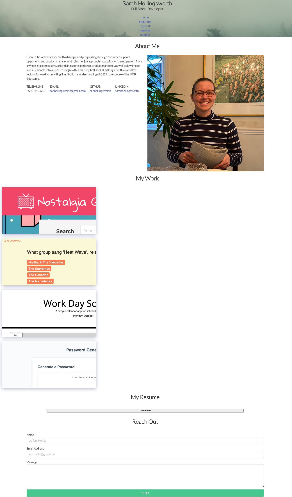

# Web Development Portfolio
This is an updated portfolio web application, built to be lightweight, responsive, and mobile first. 

It includes contact information and websites, links to repositories & applications for my project history, my resume, and a contact form for user outreach.

## Deployed Application
[Click here to see my web development portfolio.](https://sahhollingsworth.github.io/webdev-portfolio/ "link to web development portfolio web application")

## Summary
Future development on this project will be heavily focused on styling, spacing, and image improvements to ensure readability and pleasant consumability.

## Built with
* [Bulma.io CSS framework](https://bulma.io/) - Core CSS styling
* [Google Fonts](https://fonts.google.com/?preview.text_type=custom) - Custom sans-serif font family
* [Font Awesome](https://fontawesome.com/) - Button icons
* [GetForm.io](https://docs.getform.io/) - Contact form backend for generating an email upon completion of contact form
* [HTML](https://developer.mozilla.org/en-US/docs/Web/HTML)
* [CSS](https://developer.mozilla.org/en-US/docs/Web/CSS)

## Authors
* Sarah Hollingsworth
  * [Github](https://github.com/sahhollingsworth)
  * [LinkedIn](https://www.linkedin.com/in/sarahhollingsworth/)

## Acknowledgments
* Reset.css in public domain, found at [Meyer Web](http://meyerweb.com/eric/tools/css/reset/)